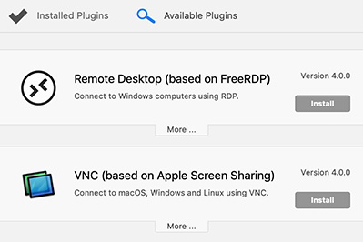
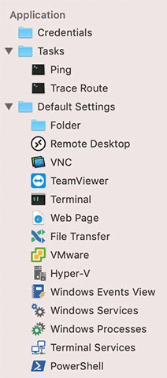
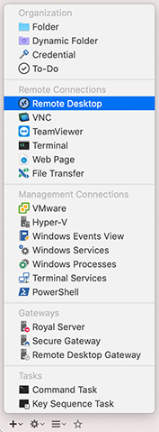

# **Getting Started**
Below you find a quick start guide for Royal TS, Royal TSX and Royal Server. Use the navigation above to browse the full documentation.

# [Royal TS](#tab/tab-id-rts)
### Quick start guide for **Royal TS for Windows**:

#### Create a new document to store your connections

Provide a name for the document and click OK.

#### Select the document or a folder in your document and create a new connection

In this example we add a new remote desktop connection. Enter a display name and computer name for the new connection.

#### Select the connection and click Connect

# [Royal TSX](#tab/tab-id-rtx)
### Quick start guide for **Royal TSX for macOS**:

#### Step 1: Install Plugins
Royal TSX is a plugin-based application. That means, before you can actually connect to any remote computer, you have to install the plugin required for that particular connection. 

 

To install plugins, open the "Royal TSX" menu and select the "Preferences" menu item, then navigate to "Plugins". You can also simply click here. 

 

The plugins screen allows you to install, uninstall and update connection plugins.

#### Step 2: Create a Document
When you first start Royal TSX you'll notice that an "Application" document was created for you automatically. This document has some unique properties: 

 

* You can password protect the Application Document. After doing so, every time you start Royal TSX you will be asked to enter your password.
* You can create folders, credentials, tasks, connection templates and edit Default Settings.
* You cannot close or delete it.
* You cannot create connections.

 

To actually create connections you have to create a new document. To do so navigate to the "File" menu and select the "New Document" menu item. You'll notice that new items have been added to the navigation panel on the left side of the main window. 

 

Documents can contain any object type supported by Royal TSX. You can have as many documents as you like but only one Application Document.

#### Step 3: Add your first connection
Now that you have one or more plugins installed and a new document set up you can actually start creating connections and using Royal TSX. To create a new connection, select the "Connections" folder that was created automatically, then click the little "plus button" on the bottom left corner of the navigation panel in the main window and select the connection type you want to create a connection for. 

 

After clicking the menu item for the connection type you want to add you'll be taken to the "connection properties dialog". This is the place where you can edit all properties available for a particular connection. The dialog also offers some generic properties that are common to all connections like "Notes" and "Custom Fields". 

 

After creating your first connection object you will be able to connect to it by simply double clicking the newly added item in the navigation panel. 

 

Tip: Remember that you can only create or edit connection objects if you have a matching plugin for that connection type installed.

# [Royal Server](#tab/tab-id-rs)
### Quick start guide for **Royal Server**:
